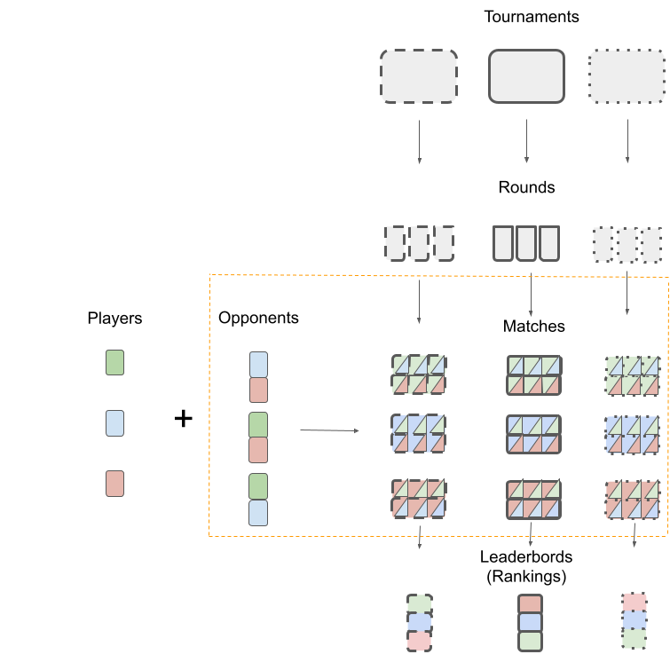

[](https://zenodo.org/badge/latestdoi/383825527)


# Elo-based Predictive Power (EPP)

This repository contains data and code necessary to reproduce figures from the article: Gosiewska A., Woźnica K., Biecek P. (2021). Interpretable Meta-Measure for Model Performance.

# Code

We created a snapshot of the environment used to generate the results included in the article. File `renv.lock` contains version of R and versions of all used R packages. Platform used for computations was: 

```
x86_64-w64-mingw32/x64 (64-bit)
Running under: Windows 10 x64 (build 22000)
```

To reproduce the results, activate `renv` project and install the `EloML` package with EPP implementation.

```{r}
renv::activate()

# if ELoML did not install use
# devtools::install_github("ModelOriented/EloML") 
# or renv::install("ModelOriented/EloML")
```

The repository contains the following folders:

- folder `scripts` that contains scrpits used to generate results included in the paper and suplementary materials. The name of each script in the folder describes the figure the script generates;

- folder `data` contains contains the data needed for the scripts, as well as the results of the scripts;

- folder `figures` contains figures included in the paper generated with scripts.

## Abstract

> Benchmarks for evaluation of model performance play an important role in Machine Learning. However, there is no established way to describe and create new benchmarks, what is more, the most common benchmarks use performance measures that share several limitations. For example, the difference in performance for two models has no probabilistic interpretation, there is no reference point to indicate whether they represent a significant improvement, and it makes no sense to compare such differences between data sets. We introduce a~new meta-measure assessment named Elo-based Predictive Power (EPP) that is built on top of other performance measures. The differences in EPP scores have a probabilistic interpretation and can be directly compared between data sets, Furthermore, the logistic regression-based design allows for an assessment of ranking fitness based on deviance statistic. We prove the mathematical properties of EPP and support them with empirical results of a large scale benchmark on 30 classification data sets and real-world benchmark for visual data. Additionally, we propose a Unified Benchmark Ontology that is used to a uniform description of benchmarks.

## Diagram of the EPP Benchmark



|    Component   |                                                       Description                                                      |                Example                |
|--------------|----------------------------------------------------------------------------------------------------------------------|-------------------------------------|
| Player_{i}     | A single i-th participant of the EPP Benchmark.                                                                        | Classification model                  |
| Score          | A one-dimensional measure of Player’s  strength. We assume that the order  relation over Scores is given and monotonic | Accuracy                              |
| Round_{r}      | A single game environment for Players. The  outcome of a Round_{r} are score values of  Players.                       | Cross-validation field                |
| Tournament     | An independently replicated Rounds.                                                                                    | Data set                              |
| Meta-Score     | A measure of a Player’s strength aggregated  over all Rounds in a Tournament.                                          | Mean                                  |
| Leaderboard    | The ordering of Players according to their  overall strength on all Rounds in a Tournament.                            | Mean accuracy of models over CV folds |
| Opponent_{i,j} | Player_{j}, whose Score values are compared to the Score values of the Player_{i}.                                     | Classification model                  |
| Match_{i,j,r}  | A single comparison of the Score values of a pair  of Players, i.e. Player_{i} and Opponent_{i,j} in  Round_{r}.       |                                       |                                 |


# Preprint

Preprint for this work is avaliable at  [https://arxiv.org/abs/2006.02293](https://arxiv.org/abs/2006.02293).

In order to cite our work please use the following BiBTeX entry

```
@article{epp,
      title={Interpretable Meta-Measure for Model Performance}, 
      author={Alicja Gosiewska and Katarzyna Woznica and Przemyslaw Biecek},
      year={2020},
      eprint={2006.02293},
      archivePrefix={arXiv},
      primaryClass={cs.LG}
}
```
